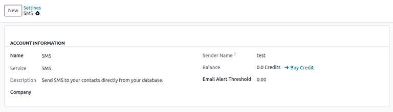
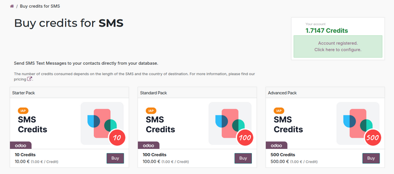
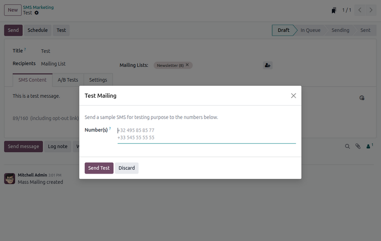

===============
Basic SMS Setup
===============

Odoo **SMS Marketing** allows users to send SMS text messages in one of two ways:

#. Using Odoo's out-of-the-box :abbr:`IAP (In-app purchases)` service.
#. Using a third-party :doc:`Twilio integration <twilio>`.

The following documentation covers the configuration process for users to send SMS messages using
Odoo :abbr:`IAP (In-app purchases)`.

Built-in SMS Configuration
==========================

In Odoo, SMS text messaging is an :abbr:`IAP (In-app purchases)` service that sends messages
directly from the database using prepaid :ref:`IAP credits <in_app_purchase/credits>`.

Each time a user sends an SMS message in Odoo, credits are deducted from the database. The pricing
of the message depends on the destination and number of characters in the message. See `Odoo SMS -
FAQ <https://iap-services.odoo.com/iap/sms/pricing#sms_faq_01>`_ for a list of prices per country.

The built-in SMS option allows users to send messages immediately with minimal configuration. Users
needing more extensive configuration or adhering to stricter compliance regulations (e.g., in
US/Canada) may use Twilio instead, although pricing may vary from the built-in option.

Register SMS account
--------------------

First-time users of the SMS service must register an SMS account through the :abbr:`IAP
(In-app-purchases)` service and purchase the required credits needed to send SMS messages.

To register an SMS account, navigate to the :menuselection:`Settings app --> Contacts section`.
Under the :guilabel:`Send SMS` field, make sure the :guilabel:`Send via Odoo` option is selected.
Then, click :guilabel:`Manage Service & Buy Credits` to open the SMS account settings page.

.. note::
   The :guilabel:`Send via Odoo` only appears if the **Twilio** module is installed. An additional
   :guilabel:`Send via Twilio` option also appears.

For first-time users, a highlighted warning message appears at the top of the page. Click
:icon:`oi-arrow-right` :guilabel:`Register` next to the message to register an SMS account.

On the :guilabel:`Register Account` pop-up window, enter a mobile phone number to receive an SMS
verification code. Once entered, click :guilabel:`Send verification code`.

After receiving the code, enter it in the :guilabel:`Verification Code` field. Then, click
:guilabel:`Register` to continue.

On the :guilabel:`Choose your sender name` pop-up window, enter a sender name between 3 and 11
alphanumeric characters. Once set, this name cannot be modified.

Once entered, click :guilabel:`Set sender name`. Alternatively, click :guilabel:`Skip for now` to
continue without setting a sender name.

.. note::
   If a sender name is not set, SMS messages are sent from a short code. A :icon:`oi-arrow-right`
   :guilabel:`Set Sender Name` option appears on the SMS account settings page for the user to
   configure when desired.

Purchase credits
----------------

Users can purchase additional credits on the SMS account settings page by clicking
:icon:`oi-arrow-right` :guilabel:`Buy Credit` next to the :guilabel:`Balance` field.

The user is then directed to a :guilabel:`Buy credits for SMS` page on the :abbr:`IAP (In-app
purchases)` portal, displaying various credit packs available for purchase.

To purchase credits, click :guilabel:`Buy` under the desired credit pack. Then, follow the prompts
on the Odoo payment page to finalize the order.

Testing
=======

After configuration, users can test that the SMS service works by sending a test marketing campaign
message or by sending an SMS directly from a contact form.

Marketing campaign test message
-------------------------------

To send a test SMS message, open or create a new SMS :doc:`marketing campaign <marketing_campaigns>`
in the **SMS Marketing** app. Create a message in the :guilabel:`SMS Content` tab, then click
:guilabel:`Test`.

Enter a test mobile number on the :guilabel:`Test Mailing` pop-up window, then click :guilabel:`Send
Test`. The user can then verify that an SMS message has been sent.

.. note::
   In the *Settings* tab of the campaign form, the user can choose to include an opt-out link in the
   SMS message. Note that this link counts towards the pricing of the message.

Contact form test message
-------------------------

Alternatively, users can also test SMS messages by sending them directly through a contact form. See
the :doc:`marketing_campaigns` documentation for more information.

.. seealso::
   - :doc:`twilio`
   - :doc:`pricing_and_faq`
