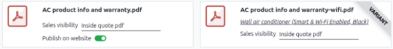

=====================
Add PDFs to a product
=====================

In Odoo **Sales** app, it's possible to add a custom PDF to a product form using the PDF Quote
builder feature. When the product is added to a quotation, the PDF is also inserted into the final
PDF and is displayed in the *Quote Builder* tab.

.. _pdf_quote_builder/add_pdf_products/add-pdf-to-product:

Add a PDF to a product
======================

To add a custom PDF to a product, go to the :menuselection:`Sales app --> Products --> Products`,
and select the desired product to add a custom PDF to.

On the product page, click the :guilabel:`Documents` smart button at the top then either click
:guilabel:`New` or :guilabel:`Upload` on the :guilabel:`Documents` page.

.. image:: add_pdf_products/documents-smart-button.png
   :alt: The Documents smart button on a product form in Odoo Sales.

Click :guilabel:`Upload` to open the local file directory of the user's computer. Select and upload
a PDF to Odoo. Click the :icon:`fa-ellipsis-v` :guilabel:`(vertical ellipsis)` icon in the corner of
the document card and select :guilabel:`Edit` to further configure the PDF.

Click :guilabel:`New` to create a blank PDF form. Upload the PDF using the :guilabel:`Upload your
file` button in the :guilabel:`File Content` field on the form.

.. _pdf_quote_builder/add_pdf_products/add-pdf-to-variant:

Add a PDF to a product variant
------------------------------

A PDF document can also be added to a product variant, rather than the parent product. If the
variant is added to a quotation, and there are documents on a product *and* on its variant, **only**
the documents in the variant are shown in the *Quote Builder* tab of the quotation.

To add a PDF to a product variant, navigate to the :menuselection:`Sales app --> Products -->
Product Variants`, select the product variant, click the :guilabel:`Documents` smart button, and
:ref:`upload the PDF <pdf_quote_builder/add_pdf_products/add-pdf-to-product>`.

The PDF document form for the product variant is the same as the parent product's PDF document form,
**except** it doesn't include the :guilabel:`E-Commerce` section and thus cannot be published on the
website.

.. _pdf_quote_builder/add_pdf_products/pdf-form-configuration:

PDF form configuration
======================

The first field on the PDF document form is for the document :guilabel:`Name`, and it is grayed out
(not clickable) until a PDF document is uploaded. Once a PDF document has been uploaded, the
:guilabel:`Name` field is auto-populated with the PDF document's name, and it can then be edited.

Prior to uploading a document, there's the option to select either :guilabel:`File` or a
:guilabel:`URL` in the :guilabel:`Type` field's drop-down menu. If a PDF is uploaded, the
:guilabel:`Type` field is automatically set to :guilabel:`File` and cannot be changed.

.. image:: add_pdf_products/document-form-uploaded-pdf.png
   :alt: A standard document form with an uploaded pdf in Odoo Sales.

For the :guilabel:`Visible at` field, in the :guilabel:`Sales` section, click the drop-down menu,
and select one of the following:

- :guilabel:`Quotation`: The PDF document is sent to (and accessible by) customers at any time.

- :guilabel:`Confirmed order`: The PDF document is sent to customers upon order confirmation. This
  is best for user manuals and other supplemental PDF documents.

- :guilabel:`Inside quote`: The PDF document is included in the PDF quotation, between the header
  pages and the :guilabel:`Pricing` section.

.. example::
   When the :guilabel:`Inside quote` option for the :guilabel:`Visible at` field is selected and the
   custom PDF document, `Corner Desk.pdf`, is uploaded, the PDF document appears in the *customer
   portal* quotation under the :guilabel:`Documents` field.

    .. image:: add_pdf_products/pdf-on-quote-sample.png
       :alt: Sample of an uploaded pdf with the on quote option chosen in Odoo Sales.

Next to the :guilabel:`File Content` field is the :guilabel:`Configure dynamic fields` link. Click
the link if the PDF document has dynamic form fields that need to be :ref:`configured to Odoo fields
<pdf_quote_builder/dynamic_text/map-PDF-to-Odoo>`. If the PDF document has custom dynamic form
fields, refer to the :ref:` pdf_quote_builder/dynamic_text/custom-dynamic-form-fields` for more
information.

In the :guilabel:`E-Commerce` section, the :guilabel:`Publish on Website` checkbox allows the PDF
document to display on the product page in the online store.

.. example::
   When the :guilabel:`Publish on Website` option is enabled, a link to the uploaded PDF document,
   `Corner Desk.pdf`, appears on the product's page in the online store.

   It appears beneath a :guilabel:`Documents` heading, with a link showcasing the name of the
   uploaded PDF document.

    .. image:: add_pdf_products/show-product-page.png
       :alt: Showing a link to an uploaded document on a product page using Odoo Sales.

.. _pdf_quote_builder/add_pdf_products/find-pdfs-for-product:

Find all configured PDFs for a product
======================================

Navigate to the :menuselection:`Sales app --> Products --> Products` and select a product. Click the
:guilabel:`Documents` smart button. This opens the :guilabel:`Documents` page and displays all the
documents for that product, including those for its variants. Variant documentation displays a
*Variant* badge on its document card, making it easy to distinguish from the parent product's
documentation.

    it's a variant PDF.

