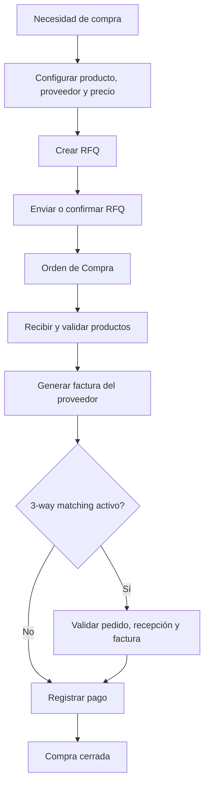

# Flujo de compras básico de Odoo

En Odoo, el flujo de compras básico es este:

1. Se detecta la necesidad de compra y se configura el producto con su proveedor y precio.
2. Se crea una RFQ o solicitud de cotización.
3. Se envía al proveedor o se confirma directamente; al confirmarla pasa a Orden de Compra.
4. Cuando el proveedor entrega, se reciben y validan los productos en inventario.
5. Se genera la factura del proveedor, según la política definida: cantidades pedidas o cantidades recibidas.
6. Si está activo el 3-way matching, Odoo controla que pedido, recepción y factura coincidan antes de pagar.
7. Finalmente, se registra el pago y la compra queda cerrada.

## Diagrama

