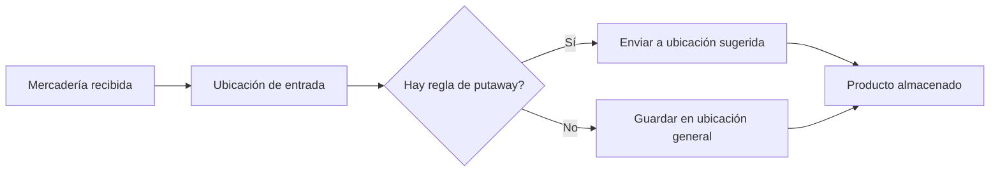
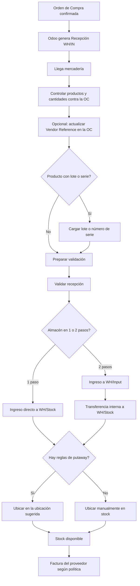

# Flujo básico de inventario para mercadería comprada en Odoo

Cuando llega mercadería comprada para almacenarla, el flujo habitual en Odoo es este:

1. La orden de compra ya fue confirmada y Odoo genera una recepción (`WH/IN`).
2. Cuando llega la mercadería, el depósito controla los productos y cantidades contra la orden de compra.
3. Si hace falta, se actualiza la referencia del proveedor en la orden de compra para dejar trazabilidad.
4. En la recepción se revisan los productos y las cantidades realmente recibidas.
5. Si el producto trabaja con lotes o números de serie, esos datos se cargan antes de validar.
6. Al validar la recepción, Odoo actualiza el movimiento de stock.
7. Si el almacén trabaja en un paso, la mercadería entra directo a `WH/Stock`.
8. Si el almacén trabaja en dos pasos, primero entra a `WH/Input` y después se hace una transferencia interna a `WH/Stock`.
9. Si existen reglas de putaway, Odoo guía la ubicación final dentro del depósito.
10. Una vez almacenada, la mercadería queda disponible para ventas, producción o movimientos internos.
11. Luego, según la política definida, puede registrarse la factura del proveedor.

## Nota

En Odoo estándar, la recepción es el documento operativo de ingreso. La documentación del proveedor puede usarse como respaldo externo, mientras que la referencia del proveedor queda asociada principalmente a la orden de compra.

## Qué son las reglas de putaway

Las reglas de `putaway` son reglas que le indican a Odoo en qué ubicación interna debe almacenarse un producto cuando ingresa al depósito.

Sirven para ordenar automáticamente la mercadería según criterios como:

- producto
- categoría de producto
- tipo de paquete

Por ejemplo:

- frutas a `WH/Stock/Fruits`
- congelados a `WH/Stock/Freezer`
- pallets a `WH/Stock/Pallets`

Odoo usa estas reglas cuando la mercadería entra por una ubicación de recepción o de stock, y así sugiere o genera el movimiento hacia su ubicación final.

## Mini diagrama de putaway

## Diagrama

