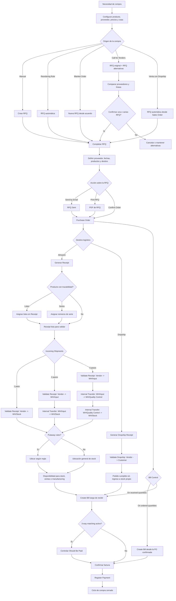

# Flujo nativo de compras en Odoo

Este archivo resume el flujo estándar de Odoo, sin localizaciones argentinas ni personalizaciones para remitos como documento independiente.

## Alcance

Incluye las posibilidades nativas más relevantes del proceso de compras:

- creación manual de RFQ
- RFQ generadas por reglas de reabastecimiento
- blanket orders
- calls for tenders o RFQ alternativas
- dropshipping
- recepción en 1, 2 o 3 pasos
- lotes y números de serie en recepciones
- facturación por cantidades pedidas o recibidas
- 3-way matching

## Flujo general

1. Se configura el producto para compra y, si aplica, la ruta `Buy`, la lista de precios del proveedor y los plazos de entrega.
2. La necesidad de compra puede comenzar de varias formas nativas: manualmente desde `Purchase`, por una regla de reabastecimiento, desde un `Blanket Order`, desde RFQ alternativas para comparar proveedores o automáticamente desde una venta con `Dropship`.
3. Odoo crea o completa una `RFQ`.
4. En la RFQ se define proveedor, fechas, productos, cantidades, moneda y destino logístico.
5. La RFQ puede enviarse por email, imprimirse o confirmarse directamente.
6. Al confirmar, la RFQ pasa a `Purchase Order`.
7. Según la configuración logística, la OC genera una recepción a almacén o una operación `Dropship` de proveedor a cliente.
8. Si los productos usan lotes o números de serie, esos datos deben cargarse en la recepción antes de validar.
9. La recepción puede resolverse en 1, 2 o 3 pasos, según el almacén: `1 paso` proveedor -> `WH/Stock`; `2 pasos` proveedor -> `WH/Input` -> `WH/Stock`; `3 pasos` proveedor -> `WH/Input` -> `WH/Quality Control` -> `WH/Stock`.
10. Si existen reglas de `putaway`, Odoo guía la ubicación final dentro del almacén.
11. La factura del proveedor se crea según la política del producto: `On ordered quantities` o `On received quantities`.
12. Si está activo `3-way matching`, Odoo controla el pago de la factura contra compra y recepción.
13. Finalmente, se registra el pago y el ciclo queda cerrado.

## Notas nativas importantes

- En estándar, Odoo crea la recepción a partir de la orden de compra.
- `Blanket Orders` no reemplazan la OC: generan nuevas RFQ precompletadas.
- `Calls for Tenders` permiten comparar RFQ alternativas y confirmar una o varias según producto y proveedor.
- En `Dropship`, la compra no entra al stock propio: el proveedor envía directo al cliente y Odoo valida una operación dropship.
- Para productos con lotes, Odoo exige asignar el lote antes de validar la recepción.
- Para productos con números de serie, la asignación puede hacerse en la recepción si la operación lo permite.
- Recepciones parciales y backorders forman parte del motor general de transferencias de Odoo. En esta documentación del repo, el detalle del popup de backorder está mostrado en entregas, no en compras; por eso esta parte es una inferencia del comportamiento estándar.

## Diagrama

## Referencias del repo

- RFQ y Purchase Order: `content/applications/inventory_and_mrp/purchase/manage_deals/rfq.rst`
- Blanket Orders: `content/applications/inventory_and_mrp/purchase/manage_deals/blanket_orders.rst`
- Calls for Tenders: `content/applications/inventory_and_mrp/purchase/manage_deals/calls_for_tenders.rst`
- Recepción 1 paso: `content/applications/inventory_and_mrp/inventory/shipping_receiving/daily_operations/receipts_delivery_one_step.rst`
- Recepción 2 pasos: `content/applications/inventory_and_mrp/inventory/shipping_receiving/daily_operations/receipts_delivery_two_steps.rst`
- Recepción 3 pasos: `content/applications/inventory_and_mrp/inventory/shipping_receiving/daily_operations/receipts_three_steps.rst`
- Dropshipping: `content/applications/inventory_and_mrp/inventory/shipping_receiving/daily_operations/dropshipping.rst`
- Reordering Rules: `content/applications/inventory_and_mrp/purchase/products/reordering.rst`
- Vendor Bills y 3-way matching: `content/applications/inventory_and_mrp/purchase/manage_deals/manage.rst`
- Control policies: `content/applications/inventory_and_mrp/purchase/manage_deals/control_bills.rst`
- Lotes: `content/applications/inventory_and_mrp/inventory/product_management/product_tracking/lots.rst`
- Series: `content/applications/inventory_and_mrp/inventory/product_management/product_tracking/serial_numbers.rst`
